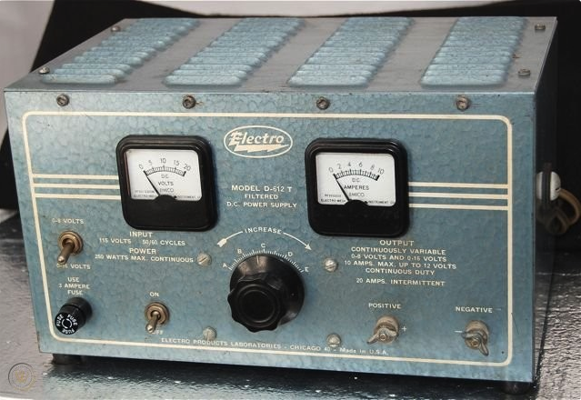

<!-- PROJECT LOGO -->
 

  <h3 align="center">Electro 612-T Retrofit</h3>
  

    Variable Filtered DC power supply (circa 1955).
  

    

## Specifications
* 0 to 16VDC
* 10A continuous, 20A intermittently
* Original Radio Shack catalog price in 1955 was $39.95.

## Included files
* Schematic (KiCad)
* Original Documents

## Updated / Replaced Parts
* Replaced selenium rectifiers with Vishay 25 Amp 400 volt bridge rectifier (GBPC2504-E4/51).
* Replaced output connectors with Deltron Banana Jacks (552-0100 BLK, 552-0500 RED).
* Added 120VAC Round Green Diamond Lens Lamp (0.5" panel press fit) in place of 0-6VDC toggle switch.
* Added 500ohm 10W Xicon cement power resistor for bleeding the capacitor.
* Replaced faulty voltmeter with Zoda 0-30VDC meter.
* Replaced faulty ammeter with Zoda 0-20A meter.
